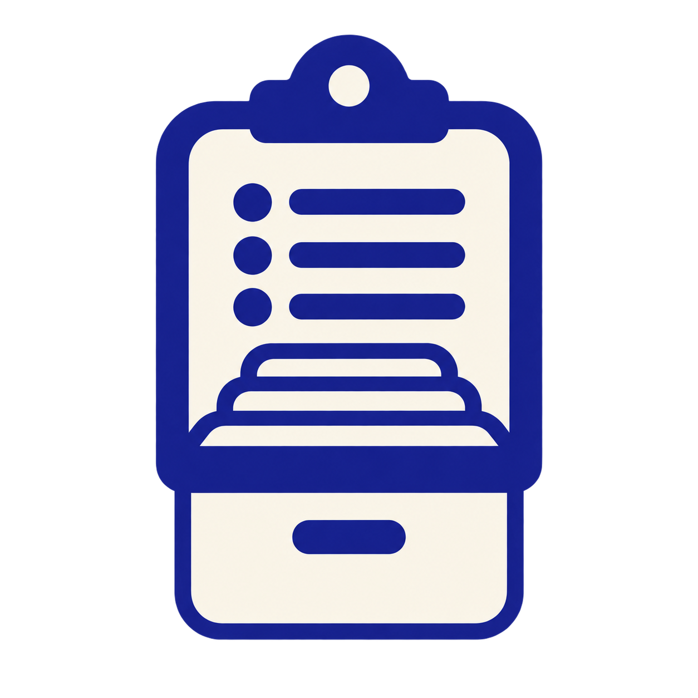

  
  <h1>Clipbox</h1>
  
<strong>Your clipboard, with a memory.</strong>

  
Ctrl+C ⌨️ Ctrl+V is great until the thing you copied three copies ago vanishes into the void. Clipbox keeps everything you copy — text, images, files — in searchable local history, so nothing is ever more than a click away.

## What is this?

Clipbox is a small desktop app that quietly watches your clipboard and saves everything to a local SQLite database. Leave it running, copy stuff like you always do, and browse it all later. That's the whole pitch. It just works.

## Features

**📋 History that actually keeps up**

- Captures text, images, screenshots, and files automatically
- Instant search across content, source app, window title, and URLs
- Filters by content type, application, and date range
- Pin the important stuff so retention pruning never touches it

**🖼️ Images get the VIP treatment**

- Full-resolution lightbox with smooth zoom, pan, and double-click toggle
- Built-in annotator: pen, highlighter, shapes, crop, undo/redo
- Export annotated images as files or straight back into history as new clips

**🗑️ A safety net for your trigger finger**

- Deletes go to **Recently Deleted** first — restore mistakes instead of regretting them
- Per-clip countdown shows exactly how long until permanent purge
- Configurable retention (1 hour to 30 days, or live dangerously with Immediately)

**🪟 A good desktop citizen**

- Hides to the system tray instead of quitting (Alt+F4 included)
- One tray click restores, focuses, or hides — it figures out which
- Custom titlebar with native-feel dragging and double-click restore
- Launch on startup, start minimized, always-on-top, global shortcuts
- Knows to ignore your password manager (configurable, as it should be)

**🔒 Private by architecture, not by promise**

Everything lives in a SQLite file on your machine (`clipbox.sqlite3` in your app-data folder). No accounts, no cloud, no telemetry phoning home. Your copied passwords stay your business.

## License

MIT — do whatever you want, just don't blame us when your clipboard history reveals your life choices.
